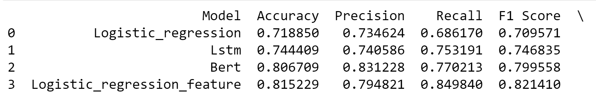
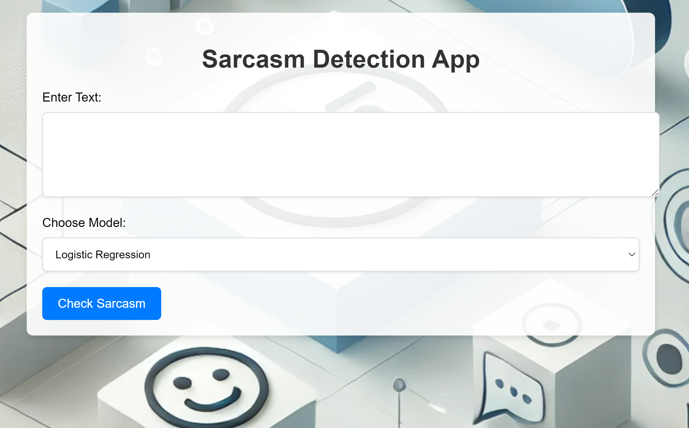
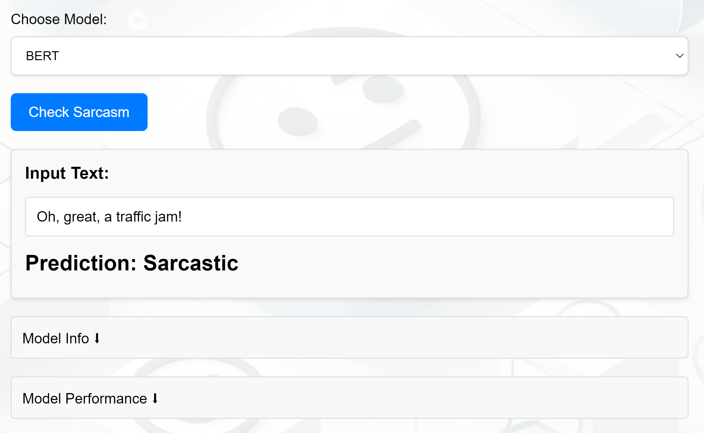
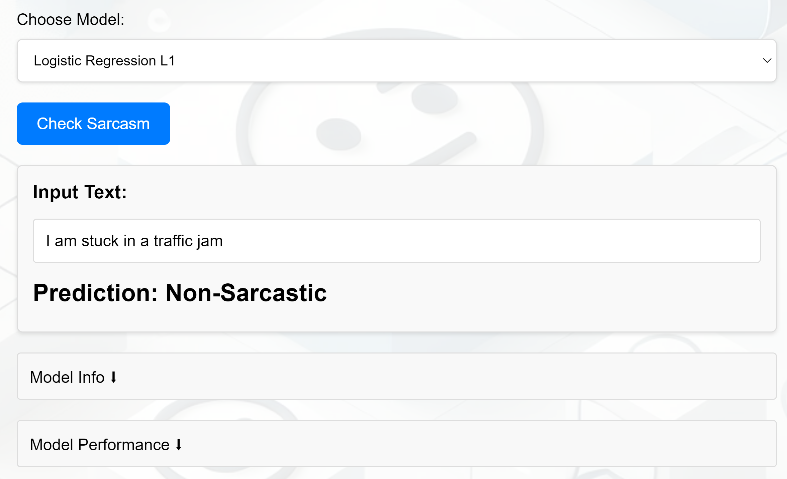

# Sarcasm Detection

## Authors:
- Satvik Pandey

## Project Description
This project aims to detect sarcasm in text using a combination of deep learning models, including Logistic Regression, LSTM, and BERT. The project features a web application where users can input text and receive sarcasm predictions. In addition to textual analysis, the model incorporates several additional features, such as the number of words, punctuation marks, and sentiment analysis using TextBlob.

## Methodology
1. **Text Processing:** 
   - For each input text, the models use techniques such as tokenization and padding (using BERTTokenizer for BERT models).
   - Additional features like word count, punctuation marks, and the presence of positive or negative words (using TextBlob) are calculated and used in the Logistic Regression.
   
2. **Model Pipeline:**
   - **Logistic Regression:** The logistic regression model uses a TF-IDF vectorizer and additional features such as text type (`General`, `Hyperbole`, or `Rhetorical Question`) to enhance the detection.
   - **LSTM:** A deep learning-based LSTM model trained on padded sequences.
   - **BERT:** A pre-trained BERT model (`TFBertForSequenceClassification`) that is fine-tuned for sarcasm detection.

3. **Web Application:**
   - The project also includes a Flask-based web application (`app.py`) where users can input text, and the models return predictions based on both text and additional feature calculations.

## Project Structure
- `Sarcasm_Detection.ipynb`: Jupyter notebook containing code for data preprocessing, feature extraction, model training, and evaluation.
- `app.py`: Flask web application for running sarcasm detection in a user-friendly interface.
- `metric.py`: Script for compiling model metrics and generating a comparative analysis of different models.
- `data/`: Contains the Sarcasm Corpus V2 data, referenced from the paper:  
  Shereen Oraby, Vrindavan Harrison, Lena Reed, Ernesto Hernandez, Ellen Riloff, and Marilyn Walker.  
  _"Creating and Characterizing a Diverse Corpus of Sarcasm in Dialogue."_  
  The 17th Annual SIGdial Meeting on Discourse and Dialogue (SIGDIAL), Los Angeles, California, USA, 2016.
- `images/`: Contains result images, including web app screenshots and model performance metrics.
- `metrics/`: Contains JSON files with model metrics for analysis.
- `models/`: Contains the serialized models (Logistic Regression, LSTM) and vectorizers.
- `best_bert_model/`: Contains the fine-tuned BERT model.
- `bert_tokenizer/`: Contains the BERT tokenizer files.
- `static/`: Contains static files for the web app, including `style.css` and a background image.
- `templates/`: Contains HTML templates for the web application.

## Requirements
- Python 3.8+
- Flask
- TensorFlow
- Transformers
- Scikit-learn
- TextBlob
- Joblib

## Results
Below are sample images demonstrating the performance of the models and the web application:

| Metrics for Models | Default Webapp Page |
| -------------- | --------------- |
|  |  |

| Sarcasm Detected | Sarcasm Not Detected |
| ------------------- | ---------- |
|  | 

## Conclusion
The performance of the sarcasm detection models demonstrates the power of combining traditional NLP techniques with modern deep learning approaches. The BERT model, which relies solely on textual data, achieved an impressive accuracy of around 80%. Its ability to understand nuanced and context-based sarcasm, particularly in subtle cases where no clear sarcasm markers (such as exaggerated punctuation or capitalization) exist, showcases its strength in grasping context. BERT's deep language understanding enables it to recognize sarcasm even when it is heavily context-driven, where other models may falter.

However, what was particularly interesting is how incorporating additional features—such as word count, punctuation, and sentiment analysis—significantly elevated the performance of simpler algorithms like Logistic Regression. These features added another layer of insight that helped the Logistic Regression model compete with BERT, bringing its performance to a similar level. This highlights that, for some tasks, simplicity combined with relevant features can yield impressive results.

While the gap between the models wasn't large in terms of accuracy, BERT excelled at understanding more complex forms of sarcasm where context played a pivotal role. On the other hand, simpler models struggled to detect sarcasm unless there were overt indicators such as capitalization, tonal shifts, or excessive punctuation.

The results also suggest that while additional features may help elevate simpler models, contextual models like BERT are naturally better at capturing underlying meaning, sarcasm subtleties, and conversational cues that go beyond surface-level text patterns.

## Further Improvements
1. **Increase the complexity of the LSTM model:** Currently, the LSTM model is quite basic. Adding more layers or experimenting with bidirectional LSTM or GRU layers could significantly improve the model's ability to capture temporal dependencies in the data.

2. **Use additional features in LSTM and BERT models:** Due to computational limitations, the additional features (like word count, punctuation, sentiment) were not incorporated into the LSTM and BERT models. Researching and integrating these features into these models could further enhance their performance.

3. **Expand the dataset for better generalization:** While the Sarcasm Corpus V2 is robust, expanding the dataset with more varied and diverse examples of sarcasm, including different dialects and informal speech, could help generalize the model to more real-world scenarios. Especially with its total size of 10000 samples, i can't help but wonder what results will an even larger dataset yield.

4. **Incorporate ensemble learning techniques:** Implementing ensemble methods by combining predictions from multiple models, such as blending Logistic Regression, LSTM, and BERT, might improve overall performance. This approach could allow the strengths of each model to complement one another, especially in complex or ambiguous cases.

5. **Work on the UI:** It's horrendous right now.

